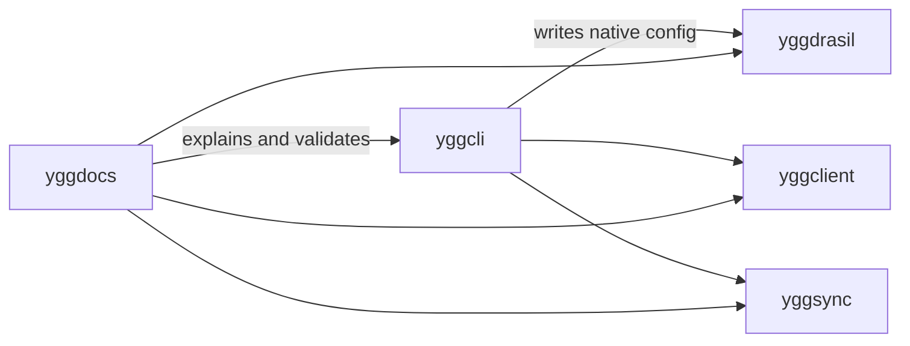
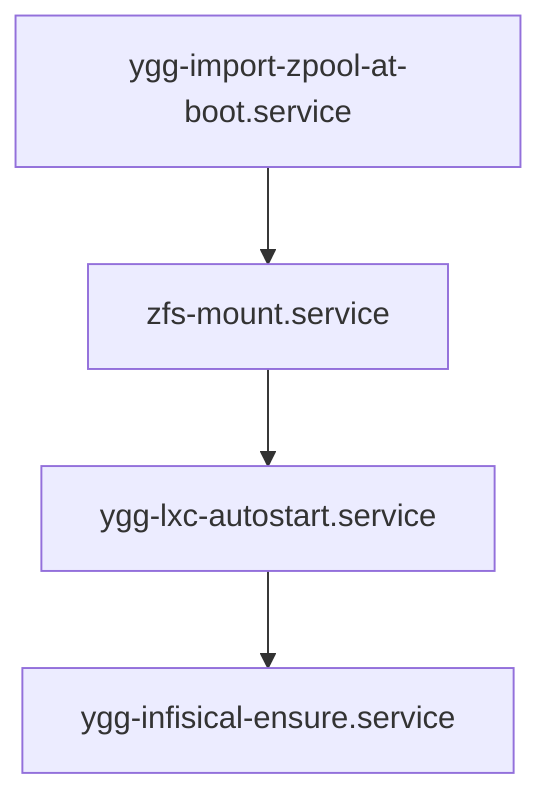

# Architecture

Yggdrasil is easiest to understand if you stop thinking in terms of “one repo builds one thing.”
It is a small ecosystem with one build spine and several operator-facing surfaces.

## Release Targets

- `server`: minimal host profile.
- `kde`: desktop/laptop profile.

Both profiles are mandatory and follow identical release gates.

## Ecosystem Shape

## Boot Chain Invariant

The live host makes the intended boot contract explicit:

This order matters.
If the pool import is late or missing, the container layer is standing on air.
If secrets-dependent services run before the fleet is up, you get a boot that looks successful but is operationally hollow.

## Runtime Services to Validate

- `ygg-import-zpool-at-boot.service`
- `ygg-lxc-autostart.service`
- `ygg-infisical-ensure.service`
- `nvidia-firstboot.service` (when NVIDIA enabled)

## LXC Baseline

- `/etc/lxc/lxc.conf` must point to `/zroot/lxc`
- `/etc/lxc/default.conf` must contain macvlan template defaults
- the default live host pattern is `macvlan` on `eno1`, but this should remain configurable

## Design Rule

Public Yggdrasil must stay moldable.
The old private stack was powerful but too hardcoded to one operator’s environment.
The new public shape keeps the same operational scaffolding while moving local truth into gitignored config files and TUI-generated state.
