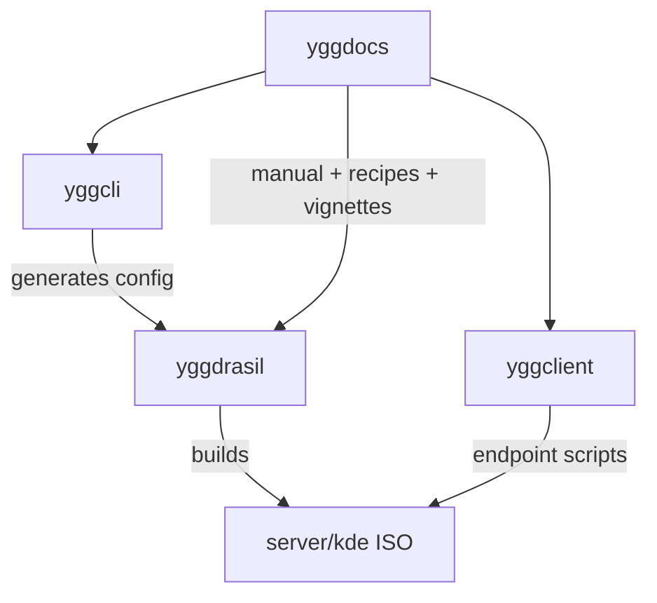

# Ecosystem Map

```mermaid
flowchart TD
  A[yggdrasil] -->|builds| B[server/kde ISO]
  C[yggcli] -->|generates config| A
  D[yggclient] -->|endpoint scripts| B
  E[yggdocs] -->|manual + recipes + vignettes| A
  E --> C
  E --> D
```

The ecosystem is intentionally split by responsibility, but documented as one journey.
