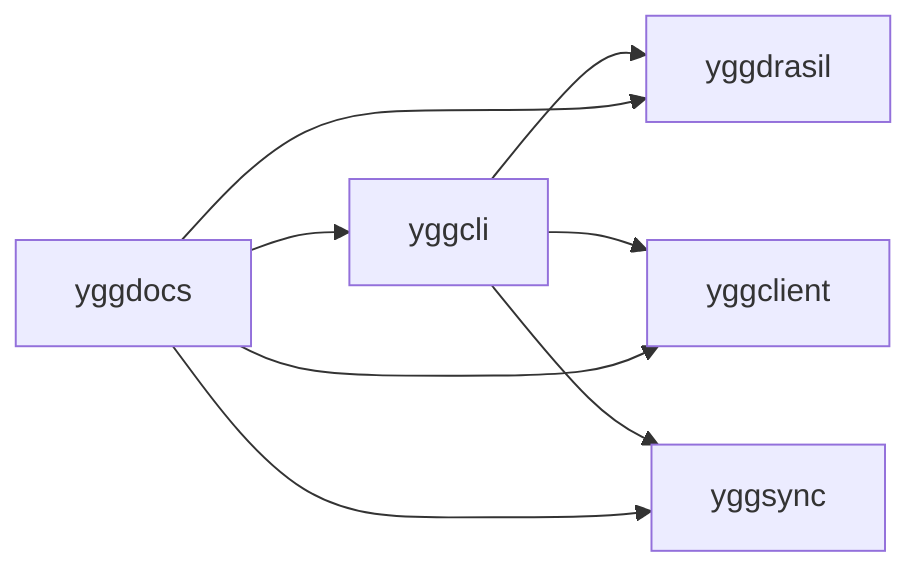

# Yggdrasil Ecosystem Manual

Start with the preface:

- [Death and Rebirth (SmartOS -> Yggdrasil)](wiki/vignettes/death-and-rebirth-smartos-to-yggdrasil.md)

Then read in sequence:

1. `quickstart` if you want the shortest path from zero to a clean first boot.
2. `wiki` if you want the operating memory: recipes, battle logs, and living patterns.
3. `dev` if you want to understand how the ecosystem is assembled without losing the plot.

This manual is written from lived infrastructure work.
It aims to be usable by newcomers, rigorous for experienced operators, and honest about tradeoffs.

## What Yggdrasil really is

Yggdrasil is not just a Debian live ISO.
It is an ecosystem with a build spine, a client layer, a sync engine, a terminal front door, and a documentation style that treats operations memory as product value.

The projects fit together like this:

If you only remember one idea, remember this:
the code makes the system possible, but the docs make it survivable.
