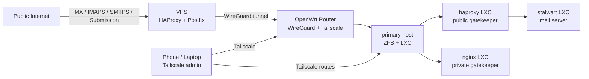
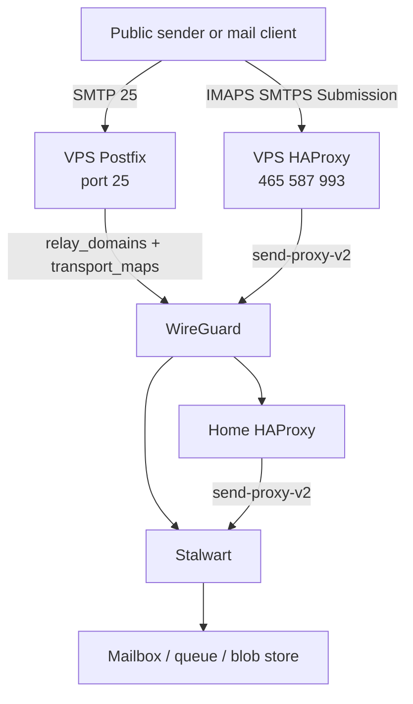

# Public Access via VPS: Mail-First Scaffold

This recipe documents the Yggdrasil pattern for exposing services from a home server without putting the home network directly on the public Internet.

The pattern is simple:

1. Keep the real service inside the home LAN.
2. Buy a small VPS with a stable public IP.
3. Connect VPS and home over WireGuard.
4. Let the VPS be the public entrypoint.
5. Forward only the traffic you mean to expose.

Mail is the first service to make public because it forces the design to handle real failure modes: stable MX, inbound SMTP on port `25`, TLS passthrough, queueing, and clean rollback.

## Topology

## Roles

- `OpenWrt router`
  - LAN default gateway.
  - Runs Tailscale for private admin access.
  - Maintains a dedicated WireGuard tunnel to the VPS.
- `primary-host`
  - Runs the LXC fleet on ZFS.
  - Keeps public-facing services isolated in containers.
- `haproxy` LXC
  - Home-side public gatekeeper.
  - Accepts only traffic coming from the VPS.
  - Preserves client IPs with PROXY v2.
- `nginx` LXC
  - Private HTTP gatekeeper for the intranet and internal reverse proxy work.
  - Not the public Internet edge.
- `stalwart` LXC
  - Real mail server.
  - Runs Stalwart and local PostgreSQL in the same container for operational simplicity.
- `relay-host.example` VPS
  - Public IP for Internet-facing mail protocols.
  - Runs HAProxy for IMAPS, SMTPS, and Submission.
  - Runs Postfix on port `25` as the backup MX / public SMTP intake point.

## Network shape

Use three paths, not one:

- `Internet -> VPS`
  - All public DNS points here.
- `VPS -> home over WireGuard`
  - Stable private transport between public edge and home LAN.
- `admin -> home over Tailscale`
  - Separate operator path.

That separation matters. Public transport and private administration should not share the same failure domain.

## Mail flow

### Inbound SMTP

1. Public senders deliver to the VPS on port `25`.
2. Postfix on the VPS accepts mail for `example.com`.
3. Postfix relays across WireGuard to the home Stalwart server.
4. Stalwart performs local delivery.

This is the piece that keeps mail flowing even if the home service is temporarily unavailable. The VPS queue is small, boring, and valuable.

### Client protocols

1. Mail clients connect to the VPS on `465`, `587`, and `993`.
2. VPS HAProxy forwards to the home `haproxy` LXC with `send-proxy-v2`.
3. Home HAProxy listens with `accept-proxy`.
4. Home HAProxy forwards to Stalwart with `send-proxy-v2`.
5. Stalwart trusts the proxy chain and sees the real client IP.

### Outbound SMTP

1. Stalwart submits outbound mail to a relay name such as `vps-relay.example`.
2. That relay name resolves to the VPS WireGuard address.
3. The VPS becomes the stable public SMTP identity.

Important detail:
Stalwart relay configuration should use a hostname, not a raw IP. If needed, pin that hostname in `/etc/hosts` inside the mail container.

## Why this pattern works

- The home server does not need a public static IP.
- Router port forwarding becomes optional or disappears entirely.
- Service exposure is centralized at one public choke point.
- The VPS can queue mail if the home server is down.
- The home side keeps protocol-specific logic in containers instead of on the router.
- ZFS snapshots remain local and fast.

## Minimal components for a common-person setup

If someone wants the smallest useful version of this pattern, keep these:

- One home host with ZFS.
- One OpenWrt router.
- One VPS with a stable public IP.
- WireGuard between router and VPS.
- One home HAProxy container.
- One application container per public service.

Do not start with a giant reverse-proxy maze. Start with one service and one clear traffic path.

## Mail-first scaffold

### 1. DNS

- Point MX to the VPS hostname.
- Point mail client hostnames to the VPS.
- Keep one internal relay name for the home-side destination, such as `vps-relay.example`.

### 2. WireGuard

- Give the VPS a tunnel address such as `10.0.0.1/24`.
- Give home a tunnel address such as `10.0.0.2/32`.
- Route the home LAN service subnet over WireGuard.
- Keep the admin plane on Tailscale; do not mix purposes.

### 3. VPS public edge

- HAProxy listens on `465`, `587`, and `993`.
- Postfix listens on `25`.
- Postfix `relay_domains` contains only the domains the VPS should queue for.
- `transport_maps` forwards those domains to the home mail server over the tunnel.

### 4. Home public gatekeeper

- Home HAProxy accepts only the VPS as the upstream source.
- Use `accept-proxy` on frontends and `send-proxy-v2` on backends.
- Keep this container narrow in scope: it is the public ingress appliance for the home side.
- Leave the private HTTP reverse proxy work to a different container such as `nginx`.

### 5. Stalwart

- Bind standard mail ports.
- Trust only the home proxies and VPS tunnel IP for proxy headers.
- Permit raw SMTP delivery from the VPS tunnel IP.
- Current production layout keeps PostgreSQL in the same container on the Debian-managed path.
- Keep exports and ZFS snapshots as the rollback mechanism instead of adding a version-specific PostgreSQL mount.

### 6. Verification

- Send mail from the public Internet and confirm the VPS relays to home.
- Stop the home mail service briefly and verify the VPS queues mail.
- Log in through IMAPS and Submission via the VPS path, not directly.
- Verify Stalwart logs show the expected source addresses.

## Upgrade and rollback discipline

Use ZFS as the first safety feature, not the last:

1. Snapshot the container rootfs dataset.
2. Snapshot the mail data dataset.
3. Export application data when the software supports it.
4. Upgrade in a rehearsal clone first if the software has schema migrations.
5. Only then touch production.

For the production layout used here, snapshot the container rootfs before Stalwart or PostgreSQL changes because the live mail store is local PostgreSQL inside the container. If `/opt/stalwart/data` is mounted separately, snapshot that as well.

## Final production notes

- Production Stalwart is on `0.15.5`.
- The mail store was migrated from RocksDB to PostgreSQL.
- PostgreSQL listens only on `127.0.0.1:5432` inside the `stalwart` container.
- Debian's `postgresql.service` is only a meta-unit; health checks should use `postgresql@18-main` or `pg_lsclusters`.
- A clean rollback set should include:
  - one snapshot before the Stalwart version jump
  - one snapshot before the PostgreSQL cutover
  - one current known-good snapshot
  - one offline export from the current version

## What to generalize later

After mail is stable, the same pattern can front other services:

- HTTPS apps through VPS HAProxy or HTTP reverse proxy.
- TCP services with HAProxy stream mode.
- Separate home gatekeepers for public and private traffic.

The rule is consistent:
public IP stays on the VPS, real state stays at home.
